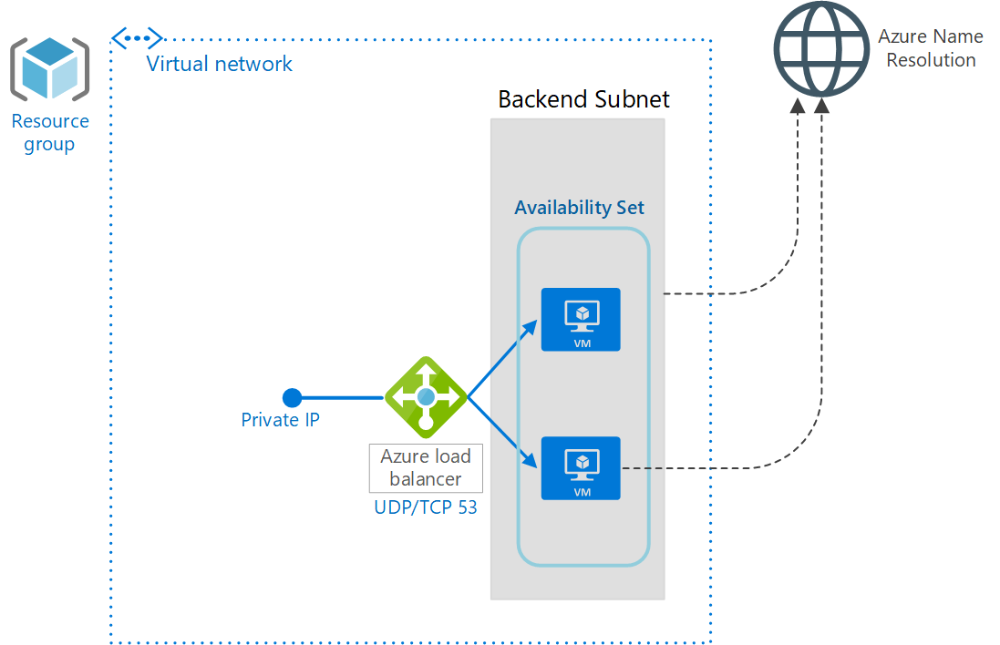

# Create 2 Virtual Machines behind an internal load balancer for DNS. 

## ARM Template

There are many use cases for having a load balanced set of DNS servers in Azure. One of which is the primary route taken for Azure Private Link is to use IaaS DNS VMs and forward those request to an Azure Private DNS Zone. After deployment, these VMs can be configured in whichever patch management solution (Azure Update Management, for example) and put them on alternate reboot schedules to allow for a single IP address to continuously resolve DNS in your Azure Virtual Network.

- This template will create two Virtual Machines behind an internal Load Balancer using TCP 53 as a health probe which listens by default on Windows DNS servers and is used for things like OPT records or DNSSEC when DNS requests are larger than 512 bytes.

- By default the script configures a the DNS servers to forward to the multicast Azure Name Resolution but you can modify the script as you see fit. This template also deploys a Storage Account, Virtual Network, Availability Set and Network Interfaces.

- The Azure Load Balancer is assigned a static IP in the Virtual Network and is configured to load balance UDP/TCP on port 53.

For a more detailed explaination, please see the corresponding blog post here: https://thetechl33t.com/2020/12/21/dns-load-balancing-in-azure/

#### Deploy with new Virtual Network

  

#### Deploy to existing Virtual Network

  

#### Deploy on LINUX with new Virtual Network

  

#### Deploy on LINUX with existing Virtual Network

  

## Azure Powershell/ Azure CLI

The Powershell and CLI for this deployment has not yet been completed, feel free to submit a PR!

## Disclaimer

THIS OPEN SOURCE MATERIAL IS PROVIDED "AS IS" WITHOUT WARRANTY OF ANY KIND, EITHER EXPRESSED OR IMPLIED, INCLUDING BUT NOT LIMITED TO THE IMPLIED WARRANTIES OF MERCHANTABILITY AND/OR FITNESS FOR A PARTICULAR PURPOSE.